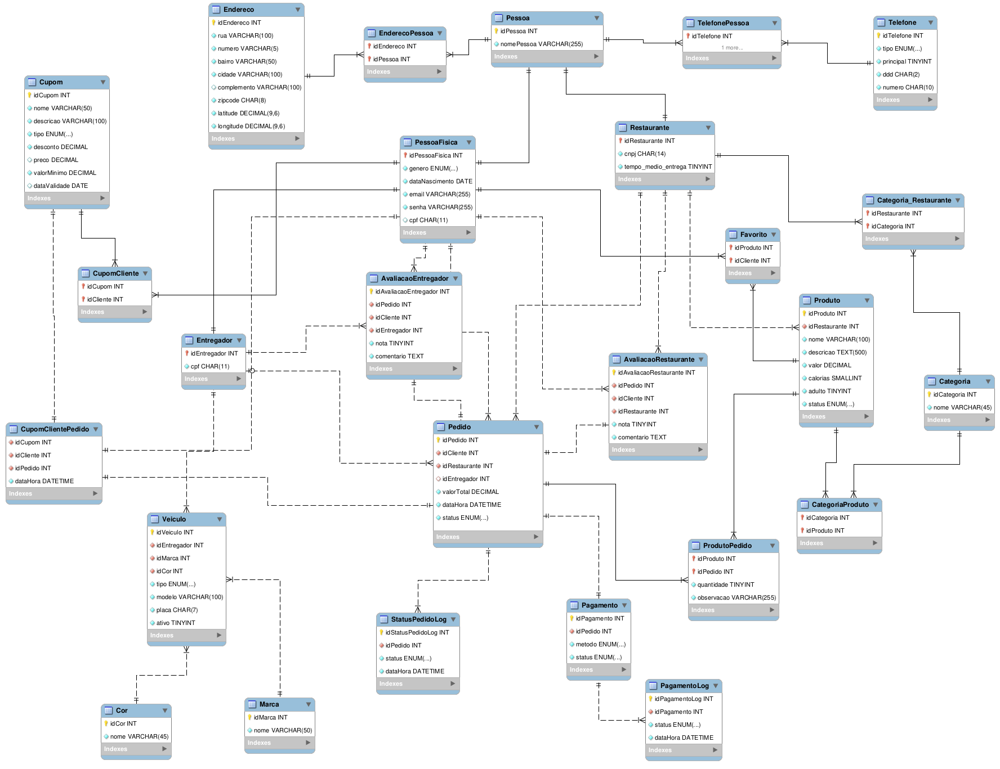

# Projeto Integrador - Modelo
# Eatly

Um modelo para o desenvolvimento do Projeto Integrador do Curso de Técnico em Desenvolvimento de Sistemas para a Internet Integrado ao Ensino Médio do IFC - Campus Araquari.

A Eatly busca expandir seus lucros intermediando vendas e entregas, além da hospedagem de restaurantes. O novo sistema permitirá pedidos online, rastreamento de entregas e avaliações. Restaurantes poderão gerenciar pedidos e cardápios, enquanto entregadores terão suporte via GPS. Administradores controlarão taxas, suporte e políticas da plataforma. A transparência será reforçada com relatórios detalhados para os restaurantes.

Equipe:
- [João](https://github.com/Joaovictor23t4)
- [Lucas](https://github.com/dnzlucas)
- [Luiz](https://github.com/LuizBlume)
- [Luna](https://github.com/LunaBolsoni)

-   [Documentação (esse documento)](https://github.com/TremboGuys/Eatly/blob/main/docs/README.md)
-   Backend: [Repositório] e [Publicação]
-   Frontend: [Repositório] e [Publicação]

# 1. Desenvolvimento

## 1.1 Modelo de sistema

### 1.1.1 Ordem de vendas

O dono de uma empresa chamada *Eatly* nos contatou com o intuito de aumentar os lucros de sua empresa. A Eatly faz parte do ramo de serviço de hospedagem de restaurantes, e há um rápido crescimento do interesse de mais restaurantes em ingressar no site. Sua forma lucrativa é por meio do aluguel da hospedagem de restaurantes no site, mas quer aumentar os seus lucros, por isso nos contactou.

# 2. Situação Problema

Sr. Diniz é dono da Eatly, uma empresa que existe a 1 ano e que conta com 2 desenvolvedores que fazem a manutenção do sistema.

No site do Sr. Diniz (Eatly), é necessário o cliente informar seu endereço, após isso ele pode escolher a categoria da comida que deseja consumir e uma seleção de restaurantes aparecem com base na categoria e endereço informados para que o cliente possa contatar o restaurante mais próximo e que mais se encaixa com sua fome. Após escolher, é informado o telefone e endereço do restaurante, para que o cliente contacte como deseja.

A forma como seu sistema lucra atualmente é com o pagamento dos restaurantes para que seus nomes apareçam nas pesquisas. Mas Diniz quer aumentar seus lucros, e conta com a gente para isso, ele pensa em além de ganhar com o aluguel dos restaurantes no sistema, também ganhar uma porcentagem das vendas realizadas no site, expandindo os serviços prestados pela empresa.

Um dos problemas que percebi no Eatly é a falta de transparência a empresa hospedada sobre quanto suas vendas aumentaram com a hospedagem no site de Sr. Diniz, e se vale apena ou não continuar pagando sua hospedagem no sistema. Uma boa maneira de ajustar é informando um relatório individual ao restaurante, sobre quantas vezes sua página foi acessada pelos clientes do Eatly, além é claro, de quantas **vendas** foram realizadas. Como vimos, o Sr. Diniz tem um pequeno software, e ele já vê os frutos da ajuda de um, mas agora, com seu software expandindo ainda mais e ficando mais robusto, ele poderá ver ainda mais benefícios, como receber outras fontes de lucro, por pagamentos de vendas realizadas, uma maior confiança dos restaurantes, com a garantia de possíveis relatórios e etc.

# 3. Descrição da Proposta

O foco de nosso software será ainda na hospedagem dos restaurantes e na sua visibilidade para pesquisas do usuário, mas agora principalmente para as vendas dos produtos desses restaurantes, e por fim na entrega de tais produtos ao usuário, agindo assim como um intermediador entre o restaurante e o cliente.

Falando agora de níveis de usuário do sistema, no planejamento é pensado em  tipos de usuário: cliente, restaurante, entregadores e administradores. Falaremos sobre as diferenças mais a frente.

As ações que um usuário poderá realizar em nosso software seriam:

- Pesquisar restaurantes por categoria alimentícia, como hambúrgueres, pizzas, pastéis, etc.
- Pesquisar um restaurante específico.
- Fazer um pedido por meio do nosso sistema.
- Acompanhar sua entrega.
- Realizar avaliações a restaurantes.

Agora sobre as diferenças de usuário:

- **Cliente**: poderá realizar pedidos e avaliações, além de processar pagamentos.
- **Restaurantes**: poderão gerenciar os pedidos que receberem, atualizar as opções de cardápio, bem como seus preços, responder avaliações de clientes e também atualizar o tempo de entrega mostrado no app conforme necessidade.
- **Entregadores**: recebem e realizam entregas, terão um GPS para a rota, bem como o valor a ser ganho na entrega, além de poder realizar avaliações a clientes e restaurantes.
- **Administradores**: gerenciam as taxas aos pedidos e mudam as políticas de privacidade caso necessário. Oferecem suporte a clientes, restaurantes e entregadores.

# 4. Modelo Entidade-Relacionamento

[PDF da Modelagem](https://drive.google.com/drive/folders/1E8S3AcIBVeQJAK0EMntGa760i8VUi3qH?hl=pt-br)

# 4. Requisitos Funcionais

RF-001: O sistema deve manter um usuário cliente.

RF-002: O sistema deve manter restaurantes.

RF-003: O sistema deve manter proprietários de restaurantes.

RF-004: O sistema deve manter entregadores.

RF-005: O sistema deve manter veículos.

RF-006: O sistema deve manter produtos.

RF-007: O sistema deve manter pedidos.

RF-008: O sistema deve oferecer suporte a rastreamento em tempo real da entrega, exibindo a localização do entregador e atualizações de status.

RF-009: O sistema deve manter cupons.

RF-010: O sistema deve oferecer cupons de frete grátis em compras acima de R$150,00.

RF-011: O sistema deve disponibilizar uma interface onde o usuário possa visualizar, adquirir e resgatar cupons, considerando regras de uso, validade, valor mínimo e limite de uso por usuário.

RF-012: O sistema deve permitir que os usuários realizem pagamentos via cartão de crédito/débito, Pix ou dinheiro.

RF-013: O sistema deve manter os planos de restaurantes (básico e de entregadores).

RF-014: O sistema deve permitir que o usuário cliente e o entregador se autentiquem por e-mail e senha ou autenticação via Google.

RF-015: O sistema fornecerá ao restaurante a autenticação via CNPJ e senha.

RF-016: O sistema deve permitir a redefinição de senha via e-mail em caso de esquecimento da mesma.

RF-017: O sistema deve permitir ao usuário cliente o salvamento de múltiplos endereços.

RF-018: O sistema deve permitir ao usuário cliente o salvamento de múltiplos números de telefone.

RF-019: O sistema deve permitir a busca de produtos e restaurantes por nome, preço, categoria e localização.

RF-020: O sistema deve permitir a filtragem de produtos dentro do cardápio do restaurante por categoria, faixa de preço e disponibilidade.

RF-021: O sistema deve permitir que o usuário acompanhe os status do seu pedido *("pendente", "em preparação", "saiu para entrega", "entregue")*.

RF-022: O sistema deve permitir que o usuário avalie um restaurante ou entregador após cada pedido.

RF-023: O sistema deve permitir ao usuário que adicione/remova um produto a seção de favoritos.

RF-024: O sistema deve manter um log de todas as alterações críticas (pedidos, pagamentos e cadastros).

RF-025: O sistema deve permitir a geração de relatórios de vendas, entregas, cupons usados e o faturamento total gerado.